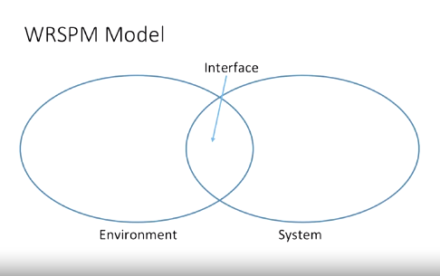

## WSPRM

- Hi. we're going to be looking at the WRSPM reference model, something we call the world machine model. 

- It's all about capturing the right thing. Requirements are always in the problem domain. It's all about what the user wants to do in order to solve some problem that they have. 

- Our job is then to take those requirements, capture them and then determine what software specifications we need in order to constrain the solution in the solution domain. 

- What we're going to do with our computer, our system in order to solve the problem. 

- And there are several layers of abstraction that exist between, what we call requirements, the user's goals, and the software specifications, what the system's goals are in order to supposedly meet those user goals or requirements. 

- The WRSPM model is one way of looking at this system in order to determine what the requirements specifications might be. 

- So this is the very formal model in the way of looking at how we separate these. So, you'll see here that we have an environment and a system.  

- So the environment is all the user-visible elements of everything in the world, which includes some part of the system where that overlaps and that overlap is called the interface.

- So, our system interface is usually a user interface, a UI, or you may have heard of a GUI, a graphical user interface. 
That's what we mean by that interface. It's the location of meeting between what the user can do and what the system can do or display to the user in order to capture input and provide output. 

- So, we then have the WRSPM model. So, we have five different elements in this model. W is the world. These are all the world assumptions, these are things that we know are true. Now, it doesn't get so complex as to say that gravity works. 

- Of course, that's a world assumption but we are more specific about the world assumptions that have an impact on our system and on our problem domain.  There are things that everyone takes for granted and they're one of the more difficult parts to capture. 

- R then is the requirements. This is the user's language understanding of what the user wants from the solution. 

- Users, for example, want to withdraw money. That's what they want to do. They go and find an ATM to do that. The ATM is the solution. 

- S is the specification. The specification lies in that interface area. It's the interface between how the system will meet those requirements. So it's still written in system language that is from a user or natural language perspective. So it says in natural language, just plain English, what the system will do. So it'll say things like, in order to withdraw money from the ATM you have to insert your card. You have to insert your PIN number. You have to select from checking or savings, you have to enter, using a numerical pad, the amount to withdraw and it has to be in $20 increments for most ATMs. Those are all things the user does not care about. The user wants to get money. 

- The specification is how they do that, how the system meets that requirement. 

- P then is the program and you'll notice that that's outside of the environment in the system. So all the way over the other side of the line. 

- That program is what the software developers will write, the program that will meet the specifications to provide the user goal for the requirements. 

- The program is all the code, underlying frameworks, anything like that that we would use from a software perspective, which leaves M all the way on the side. 

- The M is the machine. It's the hardware specification, so it includes the roller for distributing money, the lockbox to make sure that one of the business requirements is that you don't just walk up and take all the money. 

- It's the hardware behind the system. So you have this world understanding, the requirements which sit within the environment that deal with the user requirements, the specification that defines how the two will meet, the program that meets that specification in order to meet the requirements, and the machine that it all runs on. 

- Within this then, we care about four variables. e_h, e_v, s_v and s_h. 

- `e_h` are the elements of the environment that are hidden from the system. So they very well may be things that we care about outside of the system that we still have to care about. It's the parts of the environment that the user wants. 

- For example, the card. The card that they insert is something that is typically outside of the system. You can't really read the card. What we want to make sure is that the user using the ATM has a card. We prove that by making them insert a card, reading the magnetic stripe and requiring the user to enter their PIN. 

- The `e_v`, the parts that are visible to the system in the environment, are the data that's generated when you read a mag strip on the card and the entered PIN number. The PIN number exists and is hidden from the system until it's entered in the system. The data that the user enters then is the visible part of the environment in that case. So the PIN, once it's entered, would be environment information that's now visible to the system using the interface. 

- The `s_v` is the system elements that are visible in the environment. This includes things like the buttons, the information on the screen, the prompts asking them to insert their card, the prompt asking them to enter their PIN number, the stars that show up when you enter in the values so that you end up getting four asterisks so that no one looking over your shoulder can read your PIN. Those are all system elements that are visible to the user and you'll see that, again, it sits within that interface intersection. It's something that's in the interface. 

- Then all the system data that is hidden from the environment is all the other data and elements of our system. 

- So the roller behind the scenes inside the machinery that the user can't actually see, they can maybe hear it and that may or may not make it visible to the user depending on your definition, but it's typically understood as it's hidden from the user. 

- It's hidden behind the machine, it's hidden in the code, it's hidden in the data in the system. 

- For example, making sure that it gets an approval number from the actual bank before distributing money. That's all hidden from the user, though it does happen and it is important that it happens because the users hope that no one else can get their money out.

- The WRSPM model is a reference model for how we understand problems in the real world and it helps us to identify the difference between a requirement, the user domain information and the specification. 

- The system domain, how we're going to solve that problem. And you've got to be really careful to separate the two and understand the two because there is a big difference between writing down or capturing the requirements and then making specifications that really do meet those requirements. 

- Just because a system can do it, doesn't mean that it necessarily meets the requirements and having a good understanding of the entire WRSPM model helps you make sure that your specifications do in fact meet the requirements.

## Notes

1. Capturing the `Right` thing
    1. Requirements are always in the problem domain
    2. Software spesification is in the solution (computer) domain
    3. Several layers of abstraction can exist in between.
2. WRSPM Model is a reference model for how we understand problems in the real world
    1. Helps identify the difference between requirement and spesification
    2. Requirements are in the user (problem) domain
    3. Spesifications are in the system (solution) domain
    4. One must be careful to ensure that the spesification meets the requirements

## Quizizz

1. WRSPM stands for: `World, Requirement, Specification, Program and Machine.`

2. Looking at the difference between user requirements and system 
specifications in the ATM example, we know that swiping the card and  prompting for a PIN are requirements, while reading the card details and a 4-digit PIN are specifications. `True`

3. The purpose of the WRSPM model is to ensure that:  `Specifications meet the requirements.`