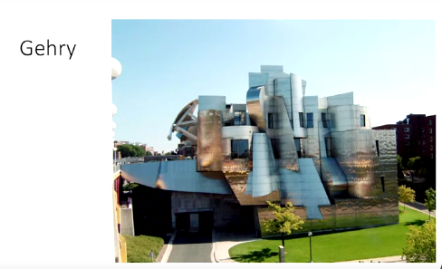
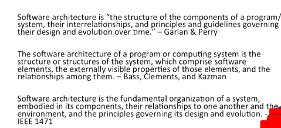
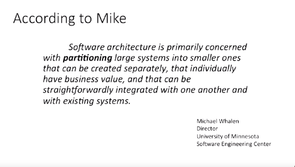

## Software Architecture: Definition

- Hi, we're going to introduce software architecture and get a better idea of what the definition of software architecture from our perspective really is.

- There's a lot of parallels between software architecture and what most people think of architecture when it comes to building buildings. 

- Architects, no matter which field it is, are that interface between the customer, what they want, and the contractor, the implementer, the person building the thing.

- And it's always too across all architecture that bad architectural design can't be rescued by good construction. 

- A bad design can't be fixed when you're building that design, it's unbelievably rare. And there's also parallels in how architects actually work. 

- There are specialist types of projects that require certain architect expertise. 

- If you can imagine, it's very different building skyscrapers than it is to build, say, a dam, or a nuclear reactor or anything else that might need to be architected in a specific way. 

- So, there are specialist types of projects within each field of architecture. 

- And in all those fields, schools of thought and styles of architecture have already emerged and continue to emerge as we work through the life cycle of all architectural projects.

- There's a relatively famous architect Frank Gehry. This is the Weisman Art Museum at the University of Minnesota. 

- Frank Gehry is one of the most, if not the most important contemporary architect. He has his own very unique style, and this is an example of that. 

- When you go and see a building that is in this particular style, it's very easy to either attribute it to a specific architect or at least a specific architectural school of thought, a style. 

- This is the same whether it's an architect of buildings or an architect of software. Though for the most part, software architecture typically isn't attributed to a single person, an artiste, but rather to a school of thought, a way of building large-scale systems.

- So what is actually software architecture? So here are three separate definitions, two of them from very popular, well-respected architecture textbooks that are used in the field. And as well as one from one of the premier international computing bodies, IEEE. 

- So, each of these definitions tends to fall into the same idea, this idea of components, this idea of separating components, comprising externally visible properties of those components and relationships between all of them.

- Here's another definition for you, this one comes from Mike Whalen, he's the director of our University of Minnesota Software Engineering Center. 

- You notice that this is a bit more practical of a definition. What we really care about is partitioning large systems into smaller ones. And these smaller systems still individually and independently have business value. 

- And that they can, supposedly, if they're written properly, be integrated with one another and other existing systems very easily. Now there's a number of reasons why this partitioning is a key component. 

- One of the things that we talk about in terms of software architecture is a decision, for example, buy versus build. 

- You need to decide whether or not the overall project you're going to build should be built by an internal team or you should go out and find an existing product, piece of software off of the Internet, off the shelf and merely customize it to your specific needs. 

- Now, buy versus build is a pretty common kind of issue that you'll have to deal with. And you have to make that decision and that's where the architecture comes in, taking the entire large system and partitioning it into smaller ones that may or may not be individually built by your team.

- Or contracted out for build by someone else and then we merely integrate them into our system. That's why that individual business value and the ability to integrate easily with one another becomes so important. 

- There's a number of reasons we should care. Most good things are well architected. If you can imagine the World Wide Web, it has been architected very well. If it wasn't so well architected, it would be much, much more fragile and collapse a lot more than it does now. 

- But it's been architected in a very decentralized and client-server architecture approach that makes it very resilient to a lot of things that might otherwise crash such a large system, because it is a large system, but it's been distributed.

- Good architecture is also very hard. A lot of success of large scale systems deals with making sure that the architecture is good. And it's really hard to do it well, so you need to make sure that you spend the time doing it.

- We also care because mistakes at the architectural level, the large-scale level, are almost, again, impossible to fix just by coding the construction part.

- When you make mistakes at the architectural level, they tend to have far reaching implications. And when you find mistakes in the architecture, if you're into the construction phase, it's almost impossible to just fix and move on. 

- A lot of times you have to, just like a dam, if there's a major design problem you have to deconstruct, demolish the whole thing and start over. That may very well be true for your entire software system too, and that's something that most companies just can't solve.

- Software architectures are about a lot of different things, okay? A big part of it is funding. One of the reasons why we decompose systems into these components that are independent is so that we can talk about parallelization.

- Who and what team are going to work on, project-manage, actually develop and test individual still potentially large sets of software that will eventually be integrated into this very large scale system. 

- When we talk about architectural patterns and architectural schools of thought, we're talking primarily about enterprise level software.

- Architecture at the small scale usually isn't all that big a deal. But as soon as you start getting into even moderately sized pieces of software in an enterprise, you have to deal with these kinds of issues. 

- Including, where are we going to get the money, the budget to pay for the developers, the project managers, the designers, the testers and beta testing, user testing, acceptance testing, to actually make sure that this project is a success? 

- All of that has to come from upfront because you need to secure the funding to do that. So software architecture is about looking at those components, determining how to separate them in order to actually make it at all practical that you'll solve the solution in any way.

## Notes

1. Parallels
    1. Architects are the technical interface between customer and contractor building <the thing>
    2. Bad architectural design cannot be rescued by good construction
    3. Specialist types of projects require architect expertise
    4. Schools and styles have emerged.
2. Why should we care?
    1. Good things are well-architected
    2. Good architecture is hard
    3. Mistakes
3. Software Architecture mainly about decomposing the system into components
    1. Each component must have individual business value
    2. Helps organize workforce and resources
    3. Allows for paralelization
    4. Helps define the build vs. buy question and getting funding

## Quiz

1. A subsystem in an architecture must: 
    1. be created separately and can operate individually.
    2. have business value. 
    3. be integrated with one another or with existing subsystems.
2. Partitioning of a large system into smaller subsystems helps the buy-or-build decision because we can examine each subsystem and reason about possible buy-or-build options for each. `True`.
3. A good software architecture is important because: 
    1. It helps organize the workforce and resources. 
    2. It allows for parallelization in development. 
    3. It helps build-or-buy decisions.
    4. It helps with funding decisions. 