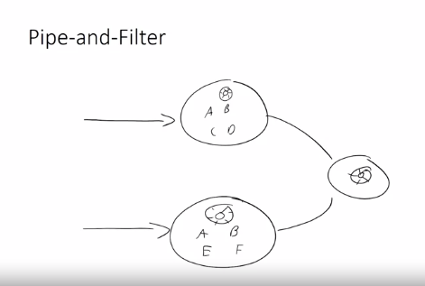
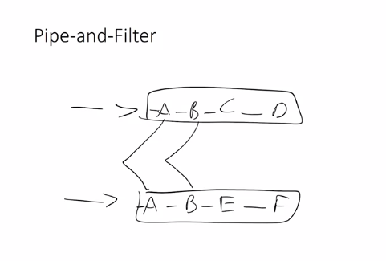
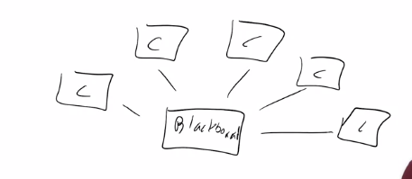
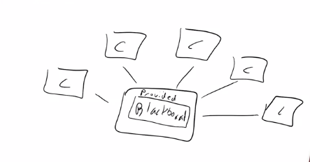
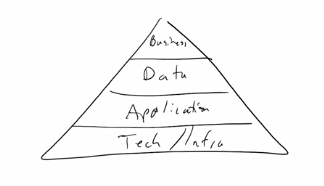
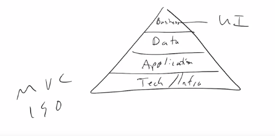
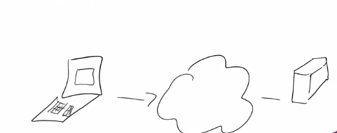
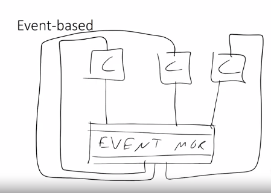

## Software Architecture: Models

- Hi, now we're going to take a closer look at some of the models that go along with software architecture. 

- So there's a variety of models that have become essentially go-to best practice models for a number of different common problems. 

- So these models are effectively best practice solutions for commonly occurring problems at the enterprise level, and you'll see what I mean here in a sec. 

- So the first one I wanted to look at is something called `Pipe-and-Filter`. So let me give you an example of a problem that you might face in the real world. 

- So we have these two incoming data sources into two relatively large-scale business logic entities.

- Within this, there are a variety of different tasks that you might have to deal with

- in order to process that data coming in. And then of course everything out of that, all the transformed data would continue on into further business logic.

- What you might see here is what we see when we look at this from an architectural perspective. What I see is that A and B are shared tasks across much larger systems. 

- This is primarily something that we want to be able to take advantage of at the enterprise level rather than having two separate teams build essentially the same task twice. because what ends up happening is that, if that task has to change in some way, which inevitably it will, then A and B could potentially start to diverge in how they work. 

- And that's not what you want to see, especially if for example, eventually down the road, one of them has a problem and the other one doesn't with the same data streams coming in. 

- That would present a really big problem that's much more difficult to debug. So what we want to be able to do then is take a look at a solution to this which provides for the reusability of these shared services, these shared subsystems. 

- What we want to be able to do is something like this instead. 

- So, we still have the two data sources coming in but instead now, we want to build these subsystems now in such a way that literally, these can be shared. 

- These are the same modules shared across overall systems so that eventually, our subsystems make use of this one in turn. Now, the way we do that is with Pipe-and-Filter. 

- So, Pipe-and-Filter tends to mean that we eventually start to build and look at these interfaces between the individual elements.

- I want you to imagine if you're working on a Unix system.

- What you end up seeing is something like information being output from one program that can be directly inserted into the next program, and on down the line. 

- It's pretty simple when you think about regular text, but we can expand this idea of solution into just about anything. As long as it has the same format for input and output, I can then rearrange and reuse any of these components in any order. For example, let's say that later on down the line we realize, we want to apply something like, element D, but we actually want to also apply that here in between parts E and F in the second subsystem. Well, if and only if we are using a Pipe-and-Filter system, we should know for a fact that we can merely insert D directly into the process flow without having to change anything. And that only works if you are particularly focused on making sure that the input and output formats are exactly the same.

- This allows us to do a lot of different things. So this is one example, but let me show you another one. This one is just as common.

- What you'll see instead is the incoming data being piped across parallelized versions of A, which then all piped to B, which piped to C, which then again parallelized back to, the business logic.

- Our ability to paralellize this information allow three different processes all using that same code base of A. All at the same time, simultaneously, allows us to very quickly get through that set if that's the most, for example, performance heavy. The same thing with part D. But then if B is relatively quick, each individual process for A can all point back to the same B process. 

- The ability to do this, to be able to reuse or even, for example, reuse in a more linear fashion, the same process over and over is keyed down to that Pipe-and-Filter idea. The idea that the same input and output formats are being used across all processes or all modules within the components. 

- This Pipe-and-Filter architecture is particularly useful in those cases where we may want to expand, parallelize, or reuse components across large systems like this. 

- So that's one focus in architectural style that can be applied to something like this. And you see that, for example, in compilers. Compilers, for example, will have things like logical analysis, pair parsing, semantic analysis, and code generation. Those should all have essentially the same types of input and output so they can be reused.

- The next primary goal for an architectural style for shared data is `Blackboard`. 

- So a Blackboard architecture is something that might look like this where we have some blackboard which you can imagine the old style chalk and white board, blackboards on the board. 

- It's one central place where you can go and look for information. This is effectively using a hub of data where all of these components then use some form of shared data or shared processing across all components. 

- So when you have important shared data that you, again, probably don't want to use global variables for, you can use something like a blackboard. That piece of functionality will then maintain integrity of that data, or integrity of the operations across many calls from many different components. 

- So the components don't really talk to each other. They talk to the Blackboard. So when they need to communicate with each other, they really don't. They communicate with the Blackboard, serving as some kind of a message queue or some other form of data repository that each component can then make use of. 

- So what we'll have here is our provided interface which needs to be very well defined so that any component can use it. Now, the tendency of these blackboard interfaces tend to be very, very big. They tend to include a lot of functionality that other components don't use. 

- There is some loss of ease of use, understandability, maintainability when it comes to that sort of thing. But if the most important aspect is the shared data, this architectural style might be useful and thinking in this format might be good.

- We also have things like `layered` architectures. Layered architectures are very, very common. You've likely seen some form of this throughout your time.

- But you might see something like business logic layer being separated from a data layer, the application layer, and then your tech or what we typically call the infrastructure layer at the bottom. 

- What we're typically talking about here are things like, we want to make sure to separate these layers for one particular reason. And another one that we see sometimes is rather than business, you might also see the UI layer listed here. 

- So when you think about hearing something like, MVC, Or the ISO model for internet topology, you might hear a lot of different layered architectures being talked about. 

- What we're trying to do here is separate somewhat core elements of the architecture, core elements of the entire system into layers such that we can modify or vary, for example, the data layer in a way that's different than how we used it before without necessarily affecting application and business layer that we have actually in here. 

- Interfaces both provided and required in between the layers that perfectly protect each other, each external layer from changes within, so that we can make changes to the data later without having to change anything else. 

- That we can make changes to the application layer without having to change anything else. This is particularly true, for example, when we commonly change the UI layer. 

- If I'm changing the User Interface layer, I shouldn't have to modify the data layer in any way when I do that. And that's very common, that you want to update the UI. This is also true if you want to, for example, switch from MariaDB to something from NoSQL, or Cassandra, or Mongoose or something like that at the infrastructure layer. 

- I should be able to do that without necessarily impacting or changing any of the code at the application level. So thinking in a layer architecture is also a way that you can partition your system.

- Another one that you've likely heard about is `Client-Server`. The Client-Server is very, very straightforward. You have yourself your laptop and then you go out to the cloud, and then somewhere over here is the Google server, and you talk to that. 

- The internet is the primary example of a Client-Server architecture. What we're talking about here is that primary, or shared, or stored, or persisted information is stored on a server, and potentially a lot of the operations and programming goes there too, and the client merely uses that service in order to perform whatever task it is. 

- So a lot of times the UI ends up being pushed to the client. And over time, we've seen a lot of changes in this model. For example, the use of AJAX and JavaScript very heavily on the client side has shifted this idea away from a pure, thin client, fat server model into more of a either mixed model or even fat client, thin server kind of model depending on the kind of programming that ends up happening on the client on your laptop when you load a webpage for example.

- Thinking in this format, changes the way you're going to build your system because now you need to think about the kinds of things that happen here on the server versus the kinds of things that are going to happen on the client.

- And lastly, we might want to look at something like an `event manager`. 

- So this is going to look similar to our Blackboard, but it's going to have some pretty key differences. So we have our event manager and then each component is listed here. 

- Now, what we tend to look at is that the event provides an interface for the components to be able to use. But then also the event manager uses each of these components based on the events, so it's always based off of some component fires an event. 

- That event is handled by the event manager which then decides which component will handle that event. 

- So in each individual case, a component will be called by something, potentially the event manager. 

- It will decide that this event has happened, it will push that event to the event manager, which will then find the correct component to handle that event, usually through adding attaching handlers to the event manager. 

- Which will then, in turn, call the component, which will then run, decide what event has occurred, and then continue to use the event manager in that loop over, and over, and over. 

- This is primarily focused on things that are event-based. When you're looking at waiting for some event to occur, and then having some action in response to that.

- These software architecture models are best-practice solutions. So these were just a couple of examples. There are many others of architectural models that you should use if your problem can be fit into this kind of a solution. 

- You should, because they are best practices, and potentially code frameworks that already exist that will help you build into one of these architectural models. 

- It's also good to see these models as a way of knowing how best to partition the work so that you can find the best people, the right amount of hardware and software, and work with the budgeting and estimation of timelines to make sure that your software project will be in the best position it can be for a success.

## Notes

1. Software Architecture Models
    1. Pipe-and-filter
    2. Blackboard
    3. Layered
    4. Client-server
    5. Event-based
    6. Etc.
2. Software architecture models are best practice solutions to commonly encountered problems:
    1. Start from the pure model, and adjust
    2. If your goals align with the goals of the model, use it
    3. Costumize the `pure` form to your needs
    4. Each models solves one particular large-scale problem

## Quizizz

1. A UNIX program where the output of one program is the input of another, is an example of which of the software architecture models below: `Pipe-and-Filter Model.`
2. An online banking system is best modeled by: `Client-Server Model.`
3. A vehicle identification and tracking system, where each moving vehicle is tracked and monitored through a shared program, is best modeled by: `Blackboard Model.`