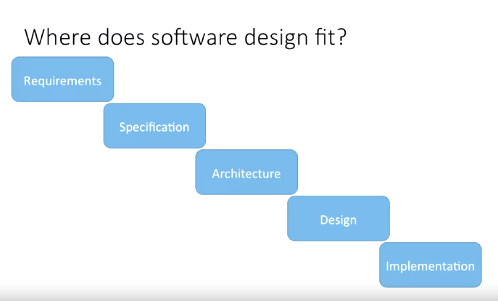
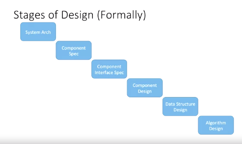

## Software Design: Introduction

- Hi. Now, we're going to get an introduction to software design. 

- In the V-model of software development, design comes into the process at the fourth stage, after architecture and before implementation. 

- It sits between the enterprise level decisions in the subsystem designing and the development effort. I want to know here that this is not the only way to represent this. 

- In fact, you're going to see architecture and design phases shown here bunched together in various places. The combined stage could be called architectural design or it could even just be called architecture or design alone even though it contains both sets of tasks. 

- We split them so that we can be more specific and provide insight into each of the responsibilities separately. Our software engineering master's program has an entire course dedicated solely to software architecture and another course solely dedicated to software design. 

- So, whether or not the company you work for separates them, is likely just a matter of semantics. What we care about is that we'll be talking about them separately. 

- So, what is software design then? Software design is what we call the deliverable, design, the noun, and what we call the process to make that design, design, the verb, is the creative process of transforming the problem into a solution. 

    - A process
    - A product of the process

- In our case, transforming a requirement specification into a detailed description of the software that's code-ready. The noun then is the documented description of that solution and the constraints and explanations used to arrive at it. 

- We develop the software design. We'll cover architecture separately but as a brief overview, architecture is primarily focused on overarching, cross-cutting concerns for our system especially in the context of the entire enterprise. 

    - What is it not? architecture, design

- Large scale decisions like, should we build or buy the software from another company? How is security going to be handled, by the server or by the application? Lots of enterprise and management-focused decisions go into this too like apportioning resources and personnel, deciding if the current staff and hardware can handle the project itself, and what it's going to cost to get us there. 

- Securing the internal funding for such endeavors is often looked at as an architectural concern. 

- The first thing we do is get a good problem understanding when it comes to design. 

- Stages of design:
    - Problem understanding
    - Identify one or more solutions
    - Describe solution abstractions
    - Repeat process for each identified abstraction until the design is expressed in primitive terms

- Most of this should come from your requirements and specification documents. 

- If you're unlucky enough not to have these or maybe at least not have them as written documents, it becomes even more important that you get a full grasp of the problem domain before starting to develop your own design solution. 

- TMTOWTDI, there's more than one way to do it. It's a pretty common acronym in technology because it's so often true. Don't be tunnel-visioned into any large-scale solution as always the only way to go about solving the problem. 

- There is almost always another way to reach the same singular goal, so consider multiple alternatives before deciding definitively which one to pursue. When we say solution abstractions, we essentially mean any documentation of the solution that isn't technological. 

- Mostly, that means anything that's not code or hardware. Graphical including mock-ups or wireframes, formal descriptions including unified modeling language or UML diagrams like class diagrams and sequence diagrams, and other descriptive notations should be used to capture your description of the solution that you intend to build or have built for you. What you're going to do is repeat for all abstractions, subsystems, components, etc. under the entire design and until the entire design is expressed in primitive terms. 

- Now, primitive terms is a bit subjective. What I want you to imagine is this, keep abstracting and designing until you are convinced that you can hand this design off to a developer team that you don't know and you're confident they will come back with a solution that's right. And you do all this without being technology-specific. 

- You let the developers, those coding in C Sharp or Java or Python decide what kind of collection to use at the code level. Let them decide exactly how to sort. Those things are very language-specific and should be left to the developers. Those decisions don't need to be made at the design level. 

- You should still be focused on what makes the overall solution work correctly, leaving all the language-specific optimization to the developer team. 

- They follow your design. They work out the optimizations at the language level. In architecture and design, we follow these six stages. The first three are architectural. 

- The last three, design. After we decide on a system architecture, separate behavior responsibility into components, and determine how those components will interact through their interfaces, we set out to design the individual components. Each component is designed in isolation, the benefit of encapsulation and reliance on those interfaces we design. 

- Once each component is fully designed in isolation, any data structures which are inherently complex, important, or shared between the classes, or even shared between components, are then designed for efficiency. 

- The same goes for algorithms. When the algorithm is particularly complex, novel, or important to the successful fulfillment of the components' required behavior, you might see software designers rather, than the developers, writing pseudo code to ensure that the algorithm is properly built. 

- Software design takes abstract requirements and then you build the detail and until you're satisfied that you can hand it off and it will be developed properly. 

- So, you're going to decide things like classes, methods, data types, that kind of thing but not the individual language-specific optimizations that will go into the eventual code. 

- So, you're going to provide detail, which is implementation-ready but it doesn't include implementation detail. 

- Software design is all about designing a solution, creating the deliverables and documentation necessary to allow the developing team to build something that meets the needs of the user or the client. 

- The best people to do that is the designing team. This is a crucial step that moves from our natural language understanding to code-ready solutions.

## Notes

- Software design takes abstract requirements and creates detail ready to be developed.
    1. Decide classes, methods, data types to be used in the solution.
    2. Separate architecture from design (or don't)
    3. Provide detail which is implementation-ready
    4. ... but doesn't include implementation detail/constrictions

## Quzziz

1. Software design is the process of transforming the stated problem into a ready-to-use implementation. `False`

2. Abstract solutions do not require extensive domain knowledge and effectively reduce the costs during the software design phase. `False`

3. It is often advised that abstract solutions do not provide optimization details regarding the implementation. `True`

4. When it comes to software design, it is always best to follow a solution that is widely popular in the industry. `False`

5. While a solution coming from software design does not include implementation details, there are still common cases where pseudocode may be provided to correctly capture the sense of a complex algorithm. `True`