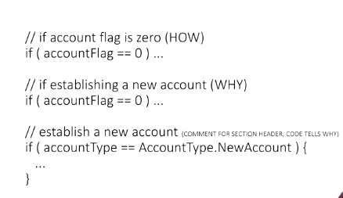

## Implementation

- Hi. now, we want to talk a little bit about implementation, the work of developing the software itself. 

- There are plenty of classes and other resources that talk specifically about how to program in Python, advanced Java features, using databases, and everything else you need to actually implement to make your planned solution work. 

- This session is instead going to focus on some tips to help you as a developer, but from a process perspective. There's two aspects to this, works worked. and when you work. 

- There's a recent Stanford research study that shows that worker output falls drastically after 50 hours in a week and it nosedives after 55 hours. 

- In fact, someone who works 70 hours in a week, produces on average, no more than those working 55 hours a week when you factor in technical debt. And anyone who has programmed will tell you about "the zone". 

- It takes long periods of uninterrupted time to do really well at development. Starting and stopping of distraction causes too much cognitive load, burning down mental models and building them back up again. 

- But don't let that betray itself by causing you to work sleep deprived. Sleep deprivation leads to mistakes. So if you happen to be managing your developers, make sure they get rest. 

- And if you stop by and they seem distracted about what they were working on when you approached, it may be that they were trying to hold their mental model together for whatever they were working on. Consider asking if coming back in 15 minutes would be better. 

- Modern compilers handle all sorts of optimizations. Let it. While you shouldn't be writing additional loops you don't need, know that you aren't really saving all that much from a performance perspective by shaving off those individual characters from your variable names. 

- Write your code so that it's as self-documenting as possible, let the compiler handle the rest of optimizing those variable names. Take a look at this code. 

- It's a pretty good example of self-documenting code or rather how to get to self-documenting code. Just having those comments there isn't enough. Saying the how, isn't as good as saying why. 

- Why you did a certain thing and allowing then the code, as in the last example, to really explain what the code is doing and using your comments to explain why you're doing it. 

- Explaining what will be there for other developers to look at if they're going to come along and say, maintain it. You've heard about test-driven development, but it's bigger than that. 

- Design is already done. You have the solution in your mind. Write it out in comments so that the code that follows makes sense in context. Document issues you run into so you don't make them again later. Trying to optimize and you forgot what was wrong with it the last time you tried it.

The Google style guide for C++ recommends that if a function is longer than 40 lines, you need to think about breaking it down. Short, focused functions, encapsulate complexity and isolate it by the use of many functions. 

- This tip is just an extension of the keep it simple principle. The class should be intuitive. The less cognitive load necessary to build something up as a mental model, the better.

- The key in this tip is about side effects: Changes to data sources outside of the method. Obviously this can't be entirely avoided or it may not even be desirable to do so, but you do want to minimize side effects, as those side effects are the very, very error-prone element to using methods in the first place.

- This is a productivity issue. The reason we say you should make a method after the second time isn't because using a method twice is all that beneficial, instead it's the idea that as soon as you've used it twice, you're probably going to use it again. 

- The longer you go without the method, the harder it is to go back and take out the 3, 4, 5, 10 different places where that code is now used. So, if you're using it twice, make it a method.

- Last thing, I want you to remember that tools exist for your benefit. If you're truly going to do code optimization, if you need to do it, let the tools help. 

- Tools will identify the areas of code that will actually benefit from optimization rather than just because the optimization is easy to find when you're reading the code. Use a code profiler and its results to focus your work.

- You can get implementation skills a lot of different places. I hope that these few tips from the process side of things will help focus you when you're doing your development work, when you're doing your implementation or when you're managing developers, to help them be more efficient from that process side. 

- There's an engineering aspect of, I want to make this as perfect as possible, but there has to be a return on investment of that time. And following these tips will get you to a place of using that return on investment for your time.

## Notes

1. Program when you are alert

2. Write code for people, not for the computer

3. Write your comments, tests, and exception handling `before` you write functional code

4. Break long methods into manageable pieces

5. Make each class represent a single, intuitive concept

6. Method focused on a single task, preferably without side effects

7. Writing code for a second time? Extract into a method

8. Optimize only when you're sure it's necessary

9. Implementation skills are training well elsewhere
    1. These tips will help you understand the difference between coder and developer
    2. People, not computers, are the primary focused.
    3. Let the computer handle optimization for computers
    4. These tips make the developers using them more effective

## Quizizz

1. Why should you program when you are alert?
    1. Sleep deprivation leads to mistakes.
    2. Output falls drastically after working 50+ hours per week.

2. Which of the following are examples of 'Write code for people not computers'?  Select three.
    1. Let your code (variable names, function names, etc.) explain HOW it does what it does.
    2. Choose informative variable names.
    3. In your comments, explain WHY the code does what it does.

3. Fill in the blank. Write ____, _____, and _____ before writing functional code. `Comments; Tests; Exception Handling.`

4. If you write the same code more than once... `Put that code into a method.`

5. True or False: Every method can be written without side effects. `False`