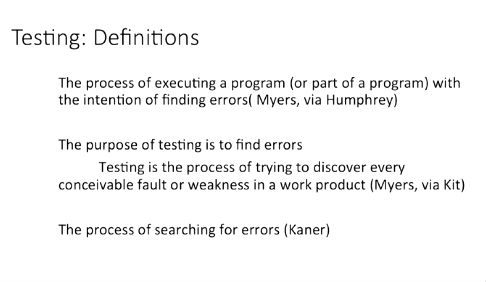
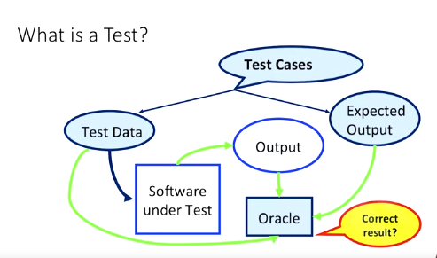

## Software Testing: Introduction

- Hi. Let's talk a little bit about how testing fits into the software development life cycle. 

- The definitions you see here, there's a couple of different ones depending on who they're from and the source that they came from. But it's all about the process of finding errors. 

- So, you can see what's common between all of them. It's now pretty much universally accepted that the purpose of testing is to find problems, find problems in one way or another. 

- Note that the first definition though, excludes the testing of documentation, which is definitely something that we do. We do a lot of testing that involves documentation and making sure the documentation, which will eventually lead to the program, is also correct. 

- First, we start with the quintessential question, what's a test? Notice that we start with the software under test. You can't test something that, you haven't created yet though test-driven development, like you would see in agile development, where we decide what the test will be before we write the code is another perspective we can take. 

- We're talking about this in terms of actually running the test, something you can only do once you have software to execute. I also want you to know that when we say software here, we don't necessarily mean the entire finished software product. Quite the contrary, even though we will eventually get to that point. 

- Software under test means, whatever part or subset of the program we have completed, where we can exercise something, we can exercise some behavior. 

- This is some module or unit of code. Therefore, unit testing. And units in this context usually mean something like a method, a function, a subroutine, a procedure, something small. A defined set of steps, or tasks that we have an expectation of how it should behave when we run that code. 

- To run a test against our software, against our unit, we must provide it with the information on which to act. The input, the test data. There are lots, and lots, and lots of ways that we can select, or even generate that test data. 

- We can generate test data based on a profile we constructed of how we think the user will act based on probability, or user studies, or we can attack the code with some data that often causes errors, inputting zero, values larger than what it asked for, giving it a word instead of a number, that sort of thing. 

- However we get the inputs, these form our test data. Now, for each of these test inputs, we run the software under test, given that test data, potentially, after setting up the software to be in the right state for that software test data to make sense when it's inputted. Something we'll get back to in a little bit. 

- Once the software is given the test data, we match the output, the behavior of the program given that input. The question then is what do we do with that? Is it right? Has the software provided the correct result given the test data? Something has to do that, something has to say is that true or not? That something, is called the oracle.

- Now, traditionally the oracle has been the developer, or the tester, who's running the tests. The tester has the software running, they input the data, they watch what happens and they decide whether or not the behavior match what they expected. Now, as you may or may not know, humans aren't particularly reliable. 

- Can you tell the difference between the number 1 and a lowercase L in some fonts on the screen? So, what we're starting to see are things like automated oracles, which compare some known, or determined, or retrieved expected output to the actual output, the output that the software generated, the actual output of running the software under test given the test data. 

- Together the input and output we should see if the program is operating as we hope it will. The test data and the expected output make up test cases. Now, let's look a little more closely about how a single test tends to happen after it decides "is it right?" 

- So, there's a distinct difference between test data and test cases as you've seen. 

- The test data is just the input to the program. And that's usually what we think of. When I ask you, for example, to test the square root function, you're really thinking about inputs, -1, 4, 16. 

- Well, what about 2, what about 1, what about -1? But we also really want to make sure that you recognize that a test case has the data, the input and what you expect for each individual output. 

- Because while humans have traditionally been the oracle, you just run it and do it. We're going to have automated oracles in the future, which means that you need both. You need input and output, that way a computer can read all those pairs and run the tests quickly. So, what's a bug? You run all these tests and you find bugs. 

- So, what exactly is a bug? Well, a system failure occurs when the delivered service deviates from the specified service. Okay. That means that something didn't happen the way it was supposed to. The specification is an agreed description of the expected service. 

- The failure occurred because the system was erroneous. An error, is that part of the system state which is liable to lead to a failure. It's whatever is wrong that leads to delivery of a surface that doesn't comply with how it's specified to work. 

- The cause and its phenomenological sense is an error, is a fault. A fault is what actually happened. Upon occurrence, a fault, a mistake, creates a latent error. 

- That latent error sits in the code and becomes effective when it's activated. That is when the code actually reaches that point and it becomes different. When the error then affects the delivered service, that is when the error actually causes a change in behavior that the user did not expect to see, that is a failure. 

- So, the error is a manifestation of a fault. And a failure is the manifestation of an error on the servers. Let me give you some examples. A programmer's mistake is a fault. 

- The consequence of that fault is a latent error in the written software. Potentially an erroneous instruction, or a piece of data that is defined improperly. 

- Upon activation, and only then, that is activation of the module where the error resides and an appropriate input pattern, activates that erroneous instruction, or uses that piece of data that's incorrect. 

- That's when the error becomes effective. When that effective error produces erroneous data, or behavior, that is the timing of the delivery, the value, or anything else that doesn't happen the way the user thinks it should happen, that is a failure. 

- So, you can have latent errors that sit in waiting in a program for years before an input pattern finally actually runs the code in that way and it produces a behavior that wasn't expected. 

- Let me give you another example. A maintenance, or operator's manual writers mistake is a fault. So, they put it in the manual improperly. The consequences an error in the corresponding manual, erroneous directives on how to use the software, which will remain latent as long as the directors aren't acted on or, for example, when no one reads the manual. 

- But when someone does read the manual and tries to use that manual to instruct how they run the code, and then the code doesn't work the way they think it should, that's still an error and therefore a failure.

- Edsger Dijkstra, among other things, was big into structured programming and the banishment of "goto". So, if you heard of, "Go To Statement Considered Harmful", that article, that's the same person.

- You can never show the absence of bugs not through testing. All we can do is run tests and find them if they find a bug. That's it. So, when to stop? When to stop testing is a very important question you have to ask yourself. 

- And there isn't any good answer to that because no amount of testing really will ever be sufficient to prove that it works. The purpose of testing is, in a sense, to prove that a program is no good. 

- Okay. That's really all there is to it. That's all we can do, is we test to prove that it's not good. We can never test to prove that it is good. When we test and it produces errors, it's no good. 

- So, software testing in and of itself is a process to find and hopefully lead to the fix of defects in your implementation. And there's no way to prove that it's correct. 

- Not really, not through testing anyway. But it's still a very important part of the process. You've got to make sure that you have quality inputs, and you have the correct expected outputs for any of this stuff to work. 

- And all of this is going to come down to the critical, "Should we release this software?" And testing is the stage in the process where you say, "No, we can't release yet because these things are still wrong." So, it becomes a very critical piece and also usually very time constrained in the process. 

- But I want to make sure that you understand the importance of software testing in software development life cycles.

## Notes

1. Test data and test cases
    1. Test Data: Inputs which have been devised to test a system.
    2. Test Cases: Inputs to the system and the predicted outputs from operating the system on these inputs, if the system performs to its spesification.

2. What is a `bug`?
    1. Failure
    2. Error. Latent & effective
    3. Fault.

3. "Dependable computing and fault tolerance: concepts and terminology" - Jean-Calude Laprie, 1985.

4. Axiom of Testing: Program testing can be used to show the presence of bugs, but never their absence - Dijkstra, 1969.

5. Software testing is a process to find (and fix) defects in a system's implementation
    1. There is no way to prove a program correct through testing
    2. Still an essential part of the process
    3. Must ensure quality of input selection and correct expected output
    4. Understanding testing is key to successful project

## Quizizz

1. Test data represents possible inputs that are provided to the _____ for the purposes of testing.
    1. system
    2. oracle

2. The oracle uses information provided from test cases to decide the correctness of the software under test. `True`

3. Test cases are composed of _______
    1. test data
    2. expected outputs

4. Manual oracles are sufficient and effective for the majority of real-world applications. `False`

5. Choose the correct True-False pair: An error is the manifestation of a failure. A failure is the manifestation of an error. `False, True`

6. It is possible for errors to remain undiscovered as long as the erroneous ________ is never used. `component`

7. It is possible for errors to remain undiscovered as long as the erroneous ________ is never used. `False`