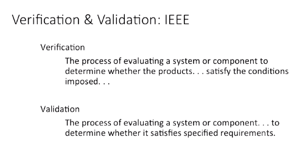
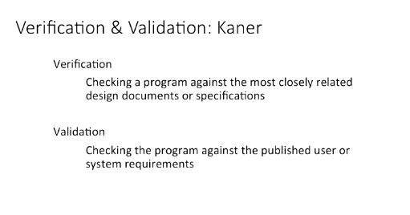
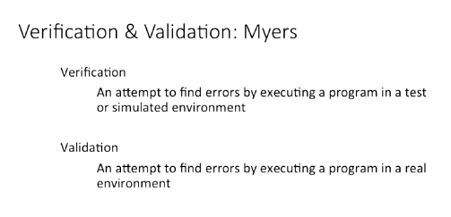
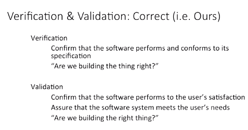
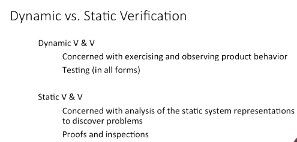

## Software Testing: Definitions

- Hi, as we begin talking about testing and its place in the software development life cycle, let's define some terms. The most important words in software testing come as this pair, Verification & Validation. 

- But before we get to our definition and give you that, let's look at how they're defined in a few places from around the industry.

- This is the definition from IEEE. It's a bit of a troublesome definition, I'll give you a chance to go ahead and read it.

- So, the issue is that it's pretty generic. The idea that it satisfies conditions imposed versus satisfying specified requirements. It doesn't really tell you a whole lot until you understand what those words mean. 

- When it comes to satisfying conditions imposed, what we mean by that is that the conditions imposed on the system, by the developers as we try and transition from what the user wants, the requirements, into what the system does in order to meet those requirements. 

- So, those are the conditions imposed, whatever we have the system actually do. Validation then is whether it satisfies the specified requirements. And they're being a little bit loose with the definition here of the word specified. 

- So, the way we interpret that definition means that it's specified as in told, explained by the users, it's what the users really want. So, the requirements are not necessarily a written-down document though we would really like it to be, but it's what the user wants. 

- So, whether it satisfies what the user said they wanted, that's essentially what validation is. But we're actually not going to just trust that definition, we're going to expand it out just a little bit. 

- So, here's another set of definitions. Professor Kaner produced what was at one time the best selling book on testing, and here's how he defines these terms.

- So when they talk about most closely related design documents or specifications, they're talking specifically about what we wrote down that we said the system will do versus again validation. Checking it against the published user or system requirements, the requirements of the system, in the user language. 

- So, this gets a little bit closer to what we tend to think of as verification and validation, but again it really focuses on design documents and specification versus requirements for the validation step.

- One more definition, another one of the bigger names in testing is Glenford Myers. 

- In his book, he defines the terms this way. This covers testing to be sure, and actually does a pretty good job of explaining the difference between verification and validation for testing. An attempt to find errors by accident program in a test environment versus Executing it in the real environment. 

- Now, we would tend to look at this definition as of a little bit too narrow scope. Validation is still executing the real environment, but doesn't necessarily include the user. 

- And we think that the user is a key component to validation, it being valid. So, here is the correct definition, or well, our definition. 

- The way we consider verification and validation is like this. Verification means that it conforms and performs to its specification, what we wrote down as it will do this. 

- This is essentially our definition of if it does these things, it meets the user requirements. Now there's a big transition there between what the user wants and what we said we're going to do. 

- So, there is some room for error in there but we have to write down what we want so that we can give it to the developers, the designers, the architects, and they actually build the system. 

- So, we write that down, and then we verify that what we built matches what we set out to build. Are we building the thing right? According to what we wanted to build, that's verification. 

- Validation, then, is that it conforms to the user's satisfaction, it's what they wanted. And it's what they need, which are not necessarily the same thing. 

- What they say they want, what they say they need, and what they actually want and need can oftentimes be different things. So, we have to actually validate on two different levels. 

- It's, this is what they need, watching them use this supposed solution, make sure it works the way that we think it will. And they are actually satisfied with the way it provides what they asked for. 

- So, it's essentially are we building the right thing? Not just, did we do what we wanted to do, but does that thing that we built right, supposedly, actually do good things. 

- Is it actually good from a usability perspective? Is it good from a security perspective? Is it good just in a pure user satisfaction level? That's validation.

- We do this through a couple of different things. 

- Dynamic and Static verification. So, Dynamic Validation and Verification or V & V. Dynamic V & V is exercizing and observing product behavior. 

- It's actually running the thing and seeing what happens. So that's why we call it dynamic, it's running the system. So that's basically testing, all forms of testing. 

- So when you go back to the Myers definition, this is really what we're looking at. So when Myers does a definition of verification and validation, he's talking specifically about dynamic verification and validation. 

- Running the system and seeing what happens. So from that perspective, his definition is quite good. Between running the testing environment and running in the real environment. 

- But there's also Static V & V. Static V & V is really all about looking at established representations of the solution that aren't necessarily running the system. 

- So this could be looking at code in terms of a code inspection, a code review, or even pair programming that you will see in a lot of agile methodologies. 

- All of that where anyone else is looking at the code and seeing things right without running it, that's static V & V. It's also formal proofs or model checking. 

- So if we went through and actually did a theorem based proof, mathematical type of proof for solutions of code and prove that it's going to work, prove that it's secure that would be considered a static V & V method. 

- And you see a lot of that in formal verification, formal testing, you see a lot of that in terms of security based testing or also this Static V & V not necessarily Dynamic V & V. 

- Which in a security standpoint would be something like penetration testing, trying to get into the system when it's actually running. So when it comes to verification and validation what we really care about is building the thing right and building the right thing. 

- In order to do that, we have to employ a lot of different testing methods. So, we're going to talk about all the different methods and tools that we can use to provide verification and validation. 

- This is both true for Dynamic and Static V & V. The thing to remember though is that verification is a lot easier and therefore it's cheaper. 

- When we have a standard, this is what we're going to build, we can verify relatively easily, did we build that? It's a much harder thing and much more expensive thing to prove that what we built, actually makes the user want to buy it.

## Notes

1. Verification and validation
    1. Building the thing right and building the right thing
    2. Regardless of definition, an important aspect of testing
    3. Dynamic and static V&V aren't exclusive
    4. Verification is cheaper/easier than validation

